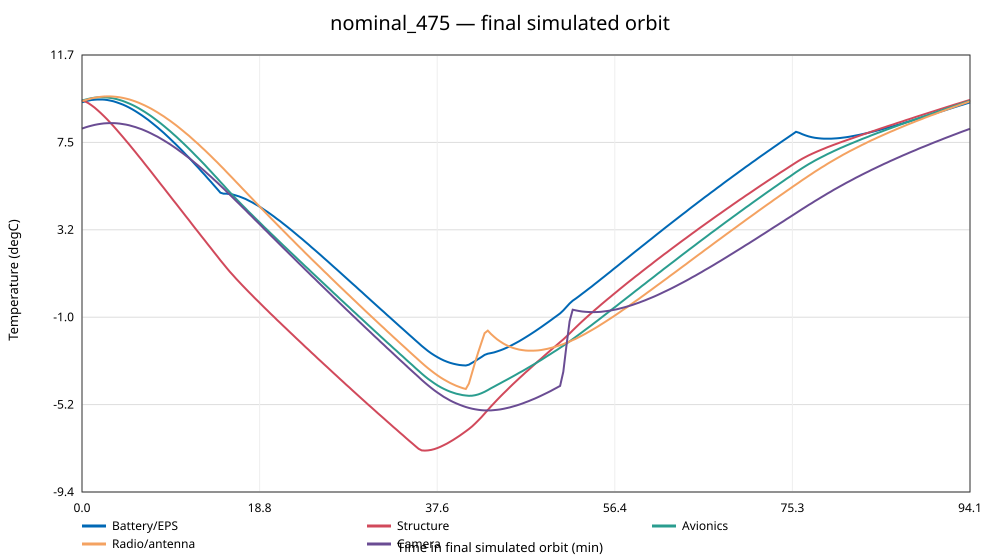
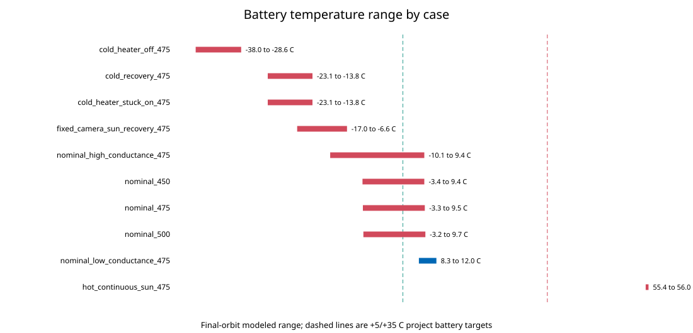

# D1-AN-THM-001 — Preliminary transient thermal-power analysis

Revision 0.1 · 2026-09-15 · **SIMULATED / PRELIMINARY / UNCORRELATED**

## Finding

The current documented 1U design does **not** close thermal control and energy
simultaneously under the central assumed thermal network. The nominal 475 km
case predicts a battery range of -3.3 to +9.5 °C, approximately 64.8% heater
duty, and -0.88 Wh of stored battery energy per orbit. The battery eventually
reaches zero state of charge in the repeated modeled case.

This is not a prediction that flight hardware will fail. Heat capacities,
surface optical properties, panel/structure joints, battery isolation and the
time-resolved attitude remain assumptions. A low-conductance sensitivity case
predicts +8.3 to +12.0 °C with closed stored-energy balance. The result therefore
shows that the undocumented thermal interfaces control feasibility and must be
designed and measured. It invalidates the earlier claim that the fixed-attitude
recovery energy case is closed independently of thermal behavior.

## Configuration modeled

The model retains all 1.0635 kg of the current B01–B16 mass allocation in eleven
lumped nodes: six 50 g solar-panel nodes, a 295 g structure/integration node, the
184 g ICEPS2/battery, a 120 g computer/carrier/adapter node, a 114.5 g
radio/antenna node and the 50 g camera. The six panel areas plus exposed rail
allocation total 0.0600 m². Component identity and mass trace to the current BOM;
specific heat, exposed rail area and all conductances are assumptions.

The central conductance network assigns 0.05 W/K from each panel to the
structure, 0.50 W/K from structure to battery/EPS, 0.30 W/K to avionics,
0.20 W/K to radio/antenna, 0.08 W/K to camera, and smaller cross-stack paths.
These values are sensitivity anchors rather than selected interfaces. The low
and high cases multiply every conductance by 0.15 and 3.0 respectively; they do
not define a manufacturable strap or isolation design.

## Governing equations

Each node uses:

`C_i dT_i/dt = Q_internal,i + Q_solar,i + Q_albedo,i + Q_EarthIR,i - Q_radiated,i + Σ G_ij(T_j-T_i)`

with `C_i = m_i c_p,i` and
`Q_radiated = epsilon sigma A (T_i^4 - T_space^4)`. Direct solar and albedo use
solar absorptivity; Earth IR and radiative rejection use IR emissivity. Electrical
power extracted at a panel is subtracted from absorbed panel heat. Battery-side
load includes the 0.85 distribution-efficiency allocation; nearly all consumed
electrical energy returns as internal heat except the modeled 29 dBm RF output.

The orbit period is two-body circular. Eclipse fraction includes beta angle and
reduces to the existing zero-beta cylindrical-shadow equation at beta zero. The
model applies charge efficiency and inhibits battery charging outside the +5 to
+40 °C project range. The automatic 1 W heater turns on at +5 °C and off at an
assumed +8 °C. A state-of-charge model couples heater and operational loads to
solar generation.

NASA's current Small Spacecraft thermal-control chapter [S41] supplies the heat-
balance structure and emphasizes low thermal mass, limited radiator area,
stacked-electronics power density, optical-property degradation and interface
conductance. NASA ARC-STD-8070.1 [S42] supplies the 1322/1367/1414 W/m² direct-
solar cases and 234 ±7 W/m² global annual-average Earth IR. It is an Ames Class
C/D standard used here for public design inputs, not an imposed DEGENERATE-1
requirement. The NASA Passive Thermal Control Engineering Guidebook [S43]
supports the model/sensitivity/correlation workflow.

## Case definitions

Ten cases cover 450, 475 and 500 km nominal zero-beta orbits; cold recovery;
heater off and stuck on; a high-beta, maximum three-face hot stress attitude; a
fixed camera-face-to-Sun recovery attitude; and low/high conductance sensitivity.
The 0.25 direct factor per panel in nominal tumble cases reproduces the project's
1.5-face isotropic mean. The hot case uses 0.288675 per face, equivalent to the
maximum square-root-of-three geometric factor, continuously; it is deliberately
conservative and is not a predicted attitude history.

Earth view, albedo view, absorptivity, emissivity and direct factors are explicit
per-case assumptions in `thermal_inputs.json`. No orbit propagation or attitude
dynamics are present. TX is applied for 120 s/orbit in nominal mode, the camera
for 60 s/orbit, and recovery receive/transmit duties match the existing power
allocation.

## Results

| Case | Battery min/max °C | Heater duty | Stored-energy margin Wh/orbit | Battery target | Energy closed |
|---|---:|---:|---:|---|---|
| nominal_450 | -3.4 / +9.4 | 65.6% | -0.91 | No | No |
| nominal_475 | -3.3 / +9.5 | 64.8% | -0.88 | No | No |
| nominal_500 | -3.2 / +9.7 | 63.9% | -0.86 | No | No |
| cold_recovery_475 | -23.1 / -13.8 | 100% | -1.31 | No | No |
| cold_heater_off_475 | -38.0 / -28.6 | 0% | -0.28 | No | No |
| cold_heater_stuck_on_475 | -23.1 / -13.8 | 100% | -1.31 | No | No |
| hot_continuous_sun_475 | +55.4 / +56.0 | 0% | -0.11 | No | No |
| fixed_camera_sun_recovery_475 | -17.0 / -6.6 | 100% | -1.83 | No | No |
| nominal_low_conductance_475 | +8.3 / +12.0 | 0% | 0.00 | Yes | Yes |
| nominal_high_conductance_475 | -10.1 / +9.4 | 78.5% | -1.17 | No | No |

`Stored-energy margin` is accepted charge energy minus battery discharge in the
final simulated orbit, including charge-temperature inhibition and charge
efficiency. A displayed 0.00 means periodic balance at full state of charge,
not an engineering margin. The hot case has abundant raw solar energy but cannot
store charge because the assumed battery temperature exceeds the charge range.





Full-precision results are in `analysis/thermal_cases.csv` and node extrema and
target margins are in `analysis/thermal_results.csv`.

## Documented design to model conflict to proposed correction

| Documented design | Model conflict | Proposed correction for review |
|---|---|---|
| 0.10 W orbit-average heater allocation and positive scalar nominal energy margin | Central thermal network requires about 0.65 W average heater before distribution losses and still crosses below +5 °C; stored energy is negative | Treat heater energy as model output. Design battery isolation, heater sizing and thresholds jointly; do not retain 0.10 W without evidence |
| Fixed camera-face recovery previously reports +0.124 Wh/orbit | Coupled case is -17.0 to -6.6 °C, heater remains on, charge stays inhibited and stored energy is -1.83 Wh/orbit | Withdraw unconditional recovery-pass wording; redesign recovery attitude/thermal path or generation allocation |
| B12 calls for a battery strap/isolation but specifies no geometry or conductance | A 20:1 conductance sensitivity changes the nominal battery result from failure to pass | Define an allowable battery-to-structure conductance range, then design and test a realizable interface to that range |
| One set of assumed dark solar-face properties | Cold assumptions freeze the stack; conservative continuous-Sun hot assumptions exceed electronics and battery targets | Select surface finishes and cell coverage using BOL/EOL alpha/epsilon data and attitude cases; reserve qualified materials for downstream release |
| Charge inhibit at +5 °C with heater on at +5 °C | Thermal lag permits substantial undershoot below the charge limit | Add control margin and independent inhibit logic after the thermal interface is defined; verify fault behavior physically |

No correction in this table changes the controlled architecture yet.

## Numerical verification

The generator runs implementation checks on every invocation. The beta-zero
eclipse identity error is 0 s. A constant-heat analytic ramp agrees within
1.1e-12 K. Pairwise conduction has zero reported energy imbalance. Reducing the
time step from 2 s to 1 s changes any nominal-case node extremum by at most
0.012 °C, below the 0.20 °C numerical criterion. Per-step model energy residuals
are retained in the case CSV. These checks verify arithmetic and discretization;
they do not validate physical inputs.

## Evidence status and limitations

This task moves the thermal concept from `CALCULATED` scalar screening to
`SIMULATED` preliminary multi-node behavior. It does not meet R10 or R22, close
O03, establish component survival, or verify a battery/heater design.

Material heat capacities are composite assumptions. Conductances are not derived
from fastener preload, contact area, interface material or measured joints.
Optical properties are not tied to selected flight finishes or EOL degradation.
Earth/albedo view factors and direct-solar factors do not come from propagated
attitude. Battery resistance, capacity versus temperature, heater placement,
EPS losses versus load, panel temperature-power feedback and internal radiation
are simplified or omitted. Charge-current limiting is not modeled. Vendor
component limits and actual charging controls remain incomplete. Cases that
reach zero modeled state of charge retain imposed thermal loads only to finish
the thermal screen; their post-depletion temperatures are not operable mission
predictions.

KDD-01/KDD-02 are needed for mission and as-procured closure. KDD-05/KDD-06 are
needed to measure interface conductance, component dissipation and time constants
and to correlate the model in thermal-vacuum/balance testing. KDD-04 independent
thermal/EPS review is required before an expert-reviewed claim.

## Reproduction

From the repository root, run:

```text
python analysis/thermal_transient.py --self-test
```

The script uses only the Python standard library and makes no network calls. It
regenerates the two CSV files, `thermal_verification.json`, and SVG plots. Inputs
are canonical in `thermal_inputs.json`; generated outputs must not be edited by
hand. The model ran with the bundled Python 3 runtime at zero incremental
software cost. Absence of a plotting package did not block the work because the
script emits reviewable SVG directly.

## Next engineering work

Refine battery thermal-interface requirements using a targeted conductance and
heater-control trade, then propagate the chosen allowable range into B12, CAD and
a bench thermal-interface coupon test plan. In parallel, replace the static
direct/view factors with time histories from the future attitude/orbit model.
Do not select a strap material, coating or heater solely from this uncorrelated
model.
